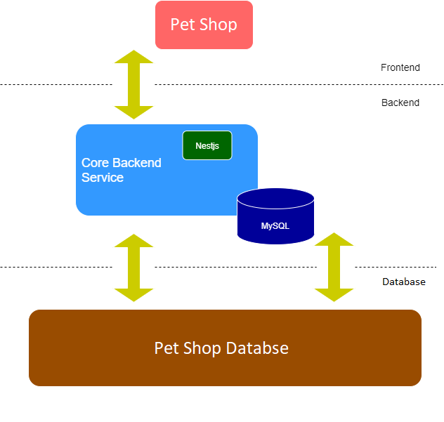

# Introduction:

-	A demo featuring an NFT website landing page where you can connect to your wallet for purchasing and collecting multiple tokens in form of animated 3D character inspired by the lovely pets that might be running around your house at the moment.

-	Further updates and development will combine your NFT pets in forms or games, physical merchandises and more! 


# Overview: 

This project infrastructure consists of mainly 1 frontend and 1 backend service:


Backend:

-	Written by NestJs, a powerful server-side NodeJs framework with:
    -	Swagger, TypeOrm and MySQL
    -	Passport-jwt
    -	Docker
    -	Class-validator, guards, exception filters, and more NestJs function are in use.

Frontend:
-   This website landing page consists of a front-end constructed by HTML5, CSS, JavaScript and a variety of potent frameworks and libraries namely Bootstrap, JQuery, Ajax.

Deploy:
-	Create an AWS account to deploy your website.


# Back-end:

-	To use this project’s backend, these are the steps:
    1.	Download Git, Docker and MySQL Workbench.
    2.	Open MySQL Workbench up and setup a new connection:
        o	Connection name: test_db
        o	Hostname: 127.0.0.1 (for localhost)
        o	Port: 4000
        o	Username: root
        o	Password: root
    3.	Open an empty folder and run command:
        ```
        git clone https://github.com/mc0505/nestjs.git
        ```
    This will clone the project repository from GitHub to your folder.
    4.  Then:
    ```
    cd nestjs/prj2/
    docker pull mysql
    docker compose up
    ```
    This will launch Dockerfile and docker-compose.yml in prj2 and create a container with 2 images which is mysql (pulled prior) and prj2_main.

-	Open browser and locate to http://localhost:3000/


# Front-end:

-	When cloning the project repository on GitHub, nestjs folder is also included with folder prj-ui which is the project frontend.
-	To run frontend on localhost, simply open folder prj-ui on File Explorer and run file index.html


# Deploy:

Backend:
-	There are 2 main services by AWS that support this website to deploy (AWS RDS and EC2)

-	RDS: 
    -	For setting up, operating and scaling a relational database in the cloud.
    -	To create a database with AWS RDS, follow the guide via this [**_link_**](https://docs.aws.amazon.com/AmazonRDS/latest/UserGuide/CHAP_Tutorials.WebServerDB.CreateDBInstance.html).

-	EC2:
    -	To create an instance for the website, follow the guide via this [**_link_**](https://docs.aws.amazon.com/AmazonRDS/latest/UserGuide/CHAP_Tutorials.WebServerDB.CreateWebServer.html).

    -   After a database and an instance is created, to connect your configured instance with your code editor and use it the way that you’d use a computer sitting in front of you. Follow the instruction via this [**_link_**]https://docs.aws.amazon.com/AWSEC2/latest/UserGuide/AccessingInstancesLinux.html(). 

-	After to SSH connection has been made. Install NodeJs, NestJs by nvm:
    ```
    $ curl -o- https://raw.githubusercontent.com/nvm-sh/nvm/v0.34.0/install.sh | bash
    $ . ~/.nvm/nvm.sh
    $ nvm install node
    ```

-	Start the backend by:
    ```
    $ npm run start:dev --host 0.0.0.0
    ```
    This would enable the backend to run on your instance IPv4 public IP or public DNS, suggest locate to your instance’s public IP with :3000 at the end will show you the website backend for simple API calls handling.


Frontend:
-	To deploy the website frontend, let’s try to pull the project’s UI from a repository from GitHub:
    o	Create a GitHub repository containing the “prj-ui” file.
    o	From your SSH host terminal, you should have Git already installed. 

    ```
    $ yum install httpd –y
    $ systemctl start httpd
    ```

    o	This will run test page to confirm that your connection with the instance is running properly. Copy your instance’s public DNS to your browser and you should see a test page.

    o	Now, locate to your SSH static file folder and clone your repository by HTTPS link.

    ```
    $ cd var/www/html
    $ vi index.html
    $ git clone https://github.com/username/repo.git
    $ cat index.html
    ```

    o	Expand the repository’s UI folder by:

    ```
    $ cp prj-ui/* .
    $ cp -rf prj-ui/* .
    ```

-   After that, locate to the public DNS link again and your website is now running properly.


